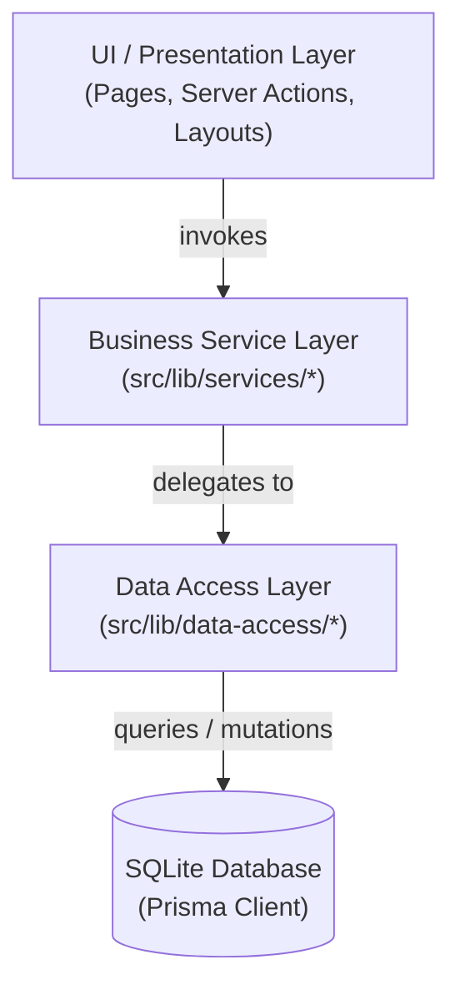
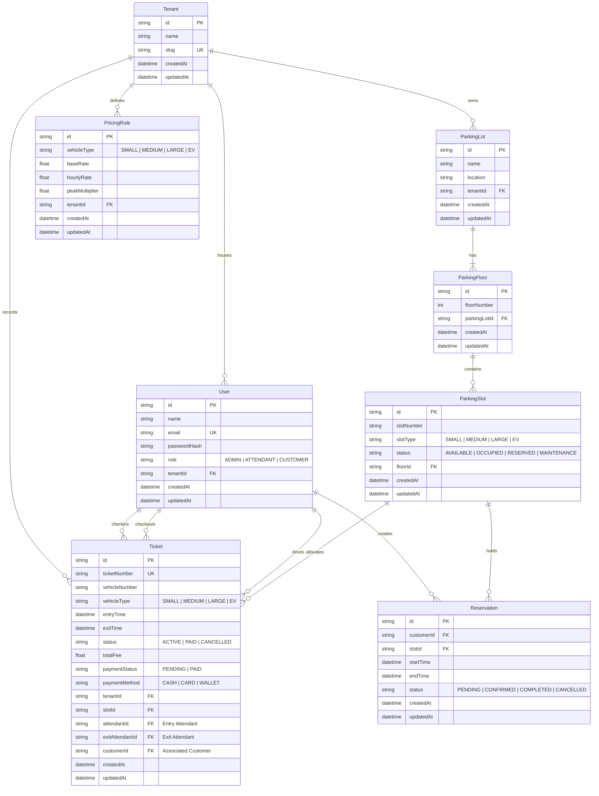

# ParkEasy SaaS: Multi-Tenant Car Parking Management System

ParkEasy SaaS is a premium, responsive, and secure **Multi-Tenant Car Parking SaaS Management System** built with **Next.js 16 (App Router)**, **Prisma ORM**, and **SQLite**. 

The system enables parking companies (tenants) to register their workspace, design custom multi-floor slot layouts, onboard attendants, manage active sessions, configure dynamic tariff pricing models, and monitor live daily, monthly, and yearly financial dashboards.

---

## 🌟 Architectural Features
* **Tenant Isolation**: Secure partitioning of resources (`User`, `ParkingLot`, `PricingRule`, `Ticket`, `Reservation`) by `tenantId`.
* **Dynamic Routing**: Automatic context resolution using dynamic sub-routes: `/tenant/[tenantSlug]/...`.
* **Stateful Flow Verification**: Pure server-side session management using cookie tokens to safely authorize attendant, customer, and admin workspaces.
* **Smart Allocation Engine**: Automatically assigns vehicles to the closest available matching parking slots (Small, Medium, Large, and EV) on gate check-in.
* **Financial Reporting Suite**: Real-time svg charts, printable receipt layouts via custom CSS print sheets, and spreadsheet-friendly CSV exports.

---

## 🏗️ Application Architecture (Three-Tier Layer)

The project implements a clean three-tier architecture to decouple layout/presentation logic, business validations, and direct database querying operations:



1. **Presentation / UI Layer (`src/app/`, `src/lib/actions.ts`)**: Decoupled server page controllers, layout templates, and client-facing Server Actions. They orchestrate views and process interactions by calling service methods. They have no direct Prisma client imports.
2. **Business Service Layer (`src/lib/services/`)**: Encapsulates business validation rules, sanitization, default definitions, fallback lookup heuristics (such as matching vehicle sizes to slot capabilities), and orchestrates multi-step processes.
3. **Data Access Layer (`src/lib/data-access/`)**: Contains raw Prisma database reads, writes, updates, and database-level transactional operations. Function names employ descriptive domain verbs (`findTenantBySlug`, `checkInTicketTransaction`, `updatePricingRule`) and keep queries highly decoupled from service-level business choices.

---

## 📊 Database Design (Visual ERD)

Below is the complete database model representation. Since the database layer is implemented using SQLite (which does not natively support enum types), data constraints are enforced at the application layer via Prisma schema validations and server-side forms.



---

## 🔒 Multi-Tenant Database Isolation

Tenant data integrity is enforced by routing all entities through a root `Tenant` mapping. Database queries always partition operations using the tenant identifier parsed from the route context or session cookie.

```
                  ┌──────────────────────────────────────────────┐
                  │          Root Tenant (e.g. Metro Park)       │
                  └──────┬────────────────────┬────────────┬─────┘
                         │                    │            │
         ┌───────────────▼──────┐      ┌──────▼──────┐     │
         │      Users List      │      │ Parking Lot │     │
         │ (Admin & Attendants) │      └──────┬──────┘     │
         └──────────────────────┘             │            │
                                       ┌──────▼──────┐     │
                                       │    Floors   │     │
                                       └──────┬──────┘     │
                                              │            │
                                       ┌──────▼──────┐     │
                                       │ Parking Slot│     │
                                       └──────┬──────┘     │
                                              │            │
                                 ┌────────────▼────────────▼───────────┐
                                 │ Tickets & Reservations Scoped Context│
                                 └─────────────────────────────────────┘
```

---

## 📋 Schema Details & Fields Reference

### 1. `Tenant`
Stores registration workspace info.
* `id` (String, PK): UUID.
* `name` (String): Business workspace name (e.g., "Metropolis Plaza Parking").
* `slug` (String, Unique Index): URL path segment (e.g., `metro-park`).

### 2. `User`
Accounts registered to a specific tenant workspace.
* `role`: Allowed string values are `"ADMIN"`, `"ATTENDANT"`, and `"CUSTOMER"`.
* `tenantId` (String, FK): Direct link to parent `Tenant`. Cascades on deletion.

### 3. `ParkingLot`
The physical parking facility structure.
* `tenantId` (String, FK): Scopes the lot to the tenant owner.

### 4. `ParkingFloor`
Floors nested under parking lots.
* Unique Constraint: `[parkingLotId, floorNumber]` ensures no duplicate floor indices exist within the same lot.

### 5. `ParkingSlot`
The atomic parking spaces.
* `slotType`: `"SMALL"` (Motorcycles), `"MEDIUM"` (Cars), `"LARGE"` (Vans/Trucks), or `"EV"` (Charging stalls).
* `status`: `"AVAILABLE"`, `"OCCUPIED"`, `"RESERVED"`, or `"MAINTENANCE"`.
* Unique Constraint: `[floorId, slotNumber]` prevents duplicate slot labels on a single floor.

### 6. `PricingRule`
Configurable dynamic pricing rates.
* `baseRate` (Float): Initial fee for entry / first hour.
* `hourlyRate` (Float): Hourly fee rate accrued post-initial hour.
* Unique Constraint: `[tenantId, vehicleType]` defines exactly one pricing config per vehicle class per tenant.

### 7. `Ticket`
Active or paid parking session tracking logs.
* `ticketNumber` (String, Unique Index): User-readable identifier prefix (e.g., `PK-2026-XXXXXX`).
* `status`: `"ACTIVE"`, `"PAID"`, or `"CANCELLED"`.
* `paymentStatus`: `"PENDING"` or `"PAID"`.
* `paymentMethod`: `"CASH"`, `"CARD"`, or `"WALLET"` (nullable).

### 8. `Reservation`
Advanced parking reservations created by customers.
* `status`: `"PENDING"`, `"CONFIRMED"`, `"COMPLETED"`, or `"CANCELLED"`.

---

## 🛠️ Getting Started & Local Setup

### Prerequisites
* **Node.js**: v18.x or above (v20+ recommended).
* **SQLite**: Embedded database (no external installation required).

### Installation

1. Install project package dependencies:
   ```bash
   npm install
   ```

2. Initialize and migrate the local SQLite database:
   ```bash
   npx prisma migrate dev --name init
   ```

3. Seed the database with default tenants, users, layouts, and pricing:
   ```bash
   npx prisma db seed
   ```

---

## 🚀 Running the App

### Start Development Server
```bash
npm run dev
```
Open [http://localhost:3000](http://localhost:3000) to view the SaaS landing page.

### Production Build & Deploy
```bash
npm run build
npm start
```

---

## 🧪 Testing and Verification

To verify the dynamic multi-tenant routes and E2E gates, you can use the archived verification scripts inside the brain's scratch folder:

* **Basic Page Integrity Checks**:
  ```bash
  npx tsx C:\Users\User\.gemini\antigravity\brain\22719528-cdaf-4bda-a033-ad012a72a745\scratch\test-pages.ts
  ```

* **Full Gate Check-In & Check-Out E2E Simulation**:
  ```bash
  npx tsx C:\Users\User\.gemini\antigravity\brain\22719528-cdaf-4bda-a033-ad012a72a745\scratch\test-e2e-flow.ts
  ```
